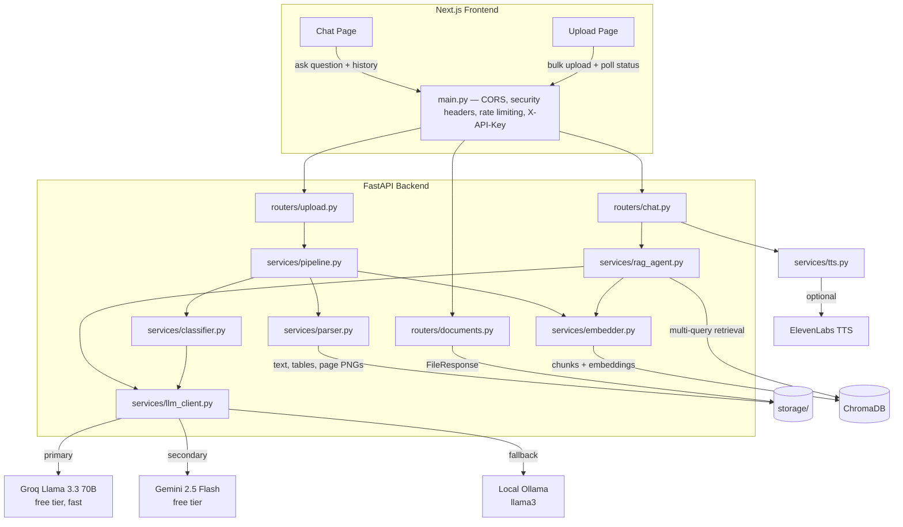

# DocumentIQ — Document Intelligence + Agentic RAG

> Built for **Build Fast with AI (BFAI)**'s AI Engineer Intern Assessment — "Document
> Intelligence + Agentic RAG". This repository contains the full submission: document
> parser, LLM-based classifier, agentic RAG chatbot with citations, bulk upload pipeline,
> and security implementation across the upload/storage/processing/API layers.

DocumentIQ lets you upload documents (PDFs, Word files, plain text — including scanned,
handwritten, table-heavy, and image-heavy pages), automatically parses and
classifies each one, and lets you ask questions about your document library
through an agentic retrieval-augmented chat assistant. Every answer is grounded
in the source material with inline `[DocumentName, p.N]` citations that link
back to a thumbnail of the exact page — if nothing relevant is found, the
assistant says so instead of guessing.

---

## Architecture



### Agentic RAG flow (`services/rag_agent.py`)

1. **Query expansion** — the LLM proposes 2 alternative phrasings of the user's
   question (falls back to the original question if the LLM is unavailable).
2. **Multi-query retrieval** — each query variant is embedded
   (`all-MiniLM-L6-v2`, local CPU) and run against ChromaDB; results are
   deduplicated by `(document_id, page_number, chunk_index)` and the
   lowest-distance hits are kept.
3. **Synthesis** — the top chunks are passed to the LLM with strict
   instructions: answer **only** from the provided context, cite every claim
   as `[DocumentName, p.N]`, and reply with the exact sentence
   *"I could not find relevant information in the uploaded documents."* if
   nothing relevant was retrieved.
4. **Citation extraction** — citations in the answer are matched back against
   the retrieved chunks' metadata (page image path, document id) and returned
   alongside the answer for the citations panel.

If no LLM provider is configured (no `GROQ_API_KEY`/`GEMINI_API_KEY`/
`OPENAI_API_KEY` and no local Ollama), the pipeline degrades to the refusal
message rather than ever inventing an answer.

---

## Tech stack

| Layer | Technology |
|---|---|
| Frontend | Next.js 14 (App Router, mixed `.js`/`.tsx`), Tailwind CSS, Framer Motion, `lucide-react`, `react-dropzone` |
| Voice input | Browser-native Web Speech API (no API key) |
| Backend | FastAPI, Uvicorn, Pydantic v2 |
| Document parsing | `pdfplumber`, `pdf2image` (poppler), `pytesseract` (tesseract OCR), `python-docx`, `Pillow`, `python-magic` |
| Classification & RAG synthesis | Groq (Llama 3.3 70B, free tier, primary) → Google Gemini 2.5 Flash (free tier) → OpenAI → local Ollama (`llama3`) |
| Voice replies | ElevenLabs TTS (optional, toggle in Settings) |
| Embeddings & vector store | `sentence-transformers` (`all-MiniLM-L6-v2`, local CPU), ChromaDB (persistent, cosine similarity) |
| Security | `slowapi` rate limiting, `X-API-Key` auth, CORS allowlist, security headers, MIME validation, filename sanitization |
| Storage | JSON document store (`storage/documents.json`) + on-disk page images / parsed JSON / vector DB |

---

## Project structure

```
DocumentIQ/
├── frontend/                      # Next.js app
│   └── src/
│       ├── app/
│       │   ├── page.js            # Landing page
│       │   └── dashboard/
│       │       ├── chat/page.tsx      # Conversation + citations (70/30 split)
│       │       ├── upload/page.tsx    # Bulk upload + pipeline tracker + library
│       │       └── settings/page.js   # Profile, backend URL, voice/notification toggles, system status
│       ├── components/            # Sidebar, Topbar, Badge, Button, etc.
│       └── lib/api.ts              # Typed API client
│
└── backend/                        # FastAPI app
    ├── main.py                     # App factory, middleware, routers, lifespan
    ├── config.py                   # Env-driven configuration
    ├── security.py                 # API key auth, rate limiter, filename sanitization
    ├── routers/
    │   ├── upload.py                # POST /api/upload/bulk, GET /api/upload/status/{id}
    │   ├── chat.py                  # POST /api/chat/ask
    │   ├── documents.py             # GET /api/upload/documents, GET /api/pages/{id}/{n}
    │   └── voice.py                 # POST /api/voice/speak (ElevenLabs TTS)
    ├── services/
    │   ├── parser.py                # PDF/DOCX/TXT -> text + tables + page images
    │   ├── classifier.py            # LLM-based document classification (Pydantic-validated)
    │   ├── embedder.py               # Chunking, embeddings, ChromaDB indexing/retrieval
    │   ├── rag_agent.py             # Query expansion -> retrieval -> synthesis -> citations
    │   ├── llm_client.py            # Groq primary / Gemini / OpenAI / Ollama fallback chain
    │   ├── tts.py                   # ElevenLabs text-to-speech wrapper
    │   ├── pipeline.py              # parse -> classify -> index -> ready/error
    │   ├── sample_loader.py         # Auto-indexes bundled sample docs on startup
    │   └── store.py                 # JSON-file document metadata store
    ├── models/schemas.py            # Pydantic request/response/data models
    ├── sample_docs/                 # 5 bundled sample documents (see below)
    └── scripts/generate_sample_docs.py
```

---

## Setup

### Prerequisites

- **Node.js** 18+
- **Python** 3.9+
- **System tools** (used by the parser):
  - [Poppler](https://poppler.freedesktop.org/) — `brew install poppler` (macOS) / `apt install poppler-utils` (Linux)
  - [Tesseract OCR](https://github.com/tesseract-ocr/tesseract) — `brew install tesseract` / `apt install tesseract-ocr`
  - [libmagic](https://www.darwinsys.com/file/) — `brew install libmagic` / `apt install libmagic1`

### 1. Backend

```bash
cd backend
python3 -m venv venv
source venv/bin/activate
pip install -r requirements.txt

cp .env.example .env
# Generate a secret and paste it into API_SECRET_KEY:
python -c "import secrets; print(secrets.token_hex(16))"
# Add GROQ_API_KEY (free, fast: https://console.groq.com/keys) — primary LLM.
# GEMINI_API_KEY (free tier: https://aistudio.google.com/app/apikey) and
# OPENAI_API_KEY are optional secondary fallbacks. If none are set, the
# backend falls back to a local Ollama server (https://ollama.com —
# `ollama pull llama3`), and if that is also unavailable it degrades
# gracefully to heuristic classification + an explicit "no relevant
# information" answer (never a hallucinated one).
# Optionally add ELEVENLABS_API_KEY to enable "AI Voice Replies" (TTS) in Settings.

uvicorn main:app --reload --port 8000
```

On first startup, the backend automatically parses, classifies, and indexes
the 5 bundled sample documents (`sample_docs/`) — no manual step required.

### 2. Frontend

```bash
cd frontend
npm install

cp .env.example .env.local
# NEXT_PUBLIC_API_URL=http://localhost:8000
# NEXT_PUBLIC_API_KEY must match API_SECRET_KEY from backend/.env

npm run dev
```

Open [http://localhost:3000](http://localhost:3000). Go to **Dashboard → Upload**
to add documents, or **Dashboard → Chat** to start asking questions
(supports voice input via the microphone button in Chrome/Edge).

---

## Sample documents

Five synthetic sample documents are bundled in `backend/sample_docs/` and are
indexed automatically on startup, covering the document variety the parser is
built to handle:

| File | Type | Notable characteristics |
|---|---|---|
| `Employee Information Form (scanned).pdf` | Form | Image-only PDF (no text layer) — exercises full-page OCR |
| `Network Architecture Overview.pdf` | Report | Multi-page with an embedded network diagram image |
| `Project Proposal.docx` | Proposal | Word document with multiple structured tables (timeline, budget) |
| `Quarterly Sales Report.pdf` | Report | Multi-page PDF with multiple data tables per page |
| `Remote Work Policy.txt` | Policy | Plain text, multi-section policy document |

---

## Security decisions

Threat model: uploaded documents may contain confidential business data
(salaries, network diagrams, employee PII, etc.), so the design assumes any
of the four layers below could be attacked independently — a malicious file,
a network eavesdropper, a curious co-tenant on the host, or an unauthenticated
API client.

### What we implemented

- **Upload layer**
  - **Upload validation** — files are checked against an extension allowlist
    (`.pdf`, `.docx`, `.txt`), a size limit (`UPLOAD_MAX_SIZE_MB`, default
    50MB), and their **actual** MIME type via `python-magic` (not just the
    client-supplied `Content-Type`), preventing disguised file uploads
    (e.g. an `.exe` renamed to `.pdf`).
  - **Filename sanitization** — uploaded filenames are stripped to their base
    name and restricted to a safe character set before being used as a path
    component, preventing path traversal (`../../etc/passwd`-style attacks).
  - **Rate limiting** (`slowapi`) — `/api/upload/bulk` is capped at 10/min per
    client IP, limiting bulk-upload abuse and disk/CPU exhaustion.
- **Storage layer**
  - **Restrictive file permissions** — uploaded files, parsed JSON, and
    rendered page images are written with `0o600` permissions (owner
    read/write only), so other local users/processes on a shared host can't
    read them.
  - **No secrets in source** — all credentials (`GROQ_API_KEY`,
    `GEMINI_API_KEY`, `API_SECRET_KEY`, etc.) are loaded from `.env`
    (git-ignored); `.env.example` documents the required variables without
    real values.
- **Processing layer**
  - **Structured table data** — tables extracted from PDFs/DOCX are stored as
    `{headers, rows}` JSON, never flattened into prose, preserving their
    structure for both display and retrieval (and avoiding accidental data
    leakage through mangled text).
  - **No hallucinated answers** — the RAG synthesis prompt requires every
    claim to be cited against retrieved chunks, and the agent returns an
    explicit refusal sentence (verbatim, matched in code) whenever no
    relevant chunks are retrieved or the LLM is unavailable — it never
    fabricates an answer about a document's contents.
- **API / retrieval layer**
  - **API key authentication** — every endpoint requires an `X-API-Key`
    header matching `API_SECRET_KEY`. The page-image endpoint additionally
    accepts the key as a query parameter (`?api_key=...`) since `` tags
    cannot send custom headers; both paths are validated identically.
  - **CORS allowlist** — `CORS_ALLOWED_ORIGINS` (comma-separated) restricts
    cross-origin requests to the configured frontend origins only.
  - **Rate limiting** (`slowapi`) — `/api/chat/ask` is capped at 30/min per
    client IP, mitigating abuse and runaway LLM costs.
  - **Security headers middleware** — every response sets
    `X-Content-Type-Options: nosniff`, `X-Frame-Options: DENY`, and
    `X-XSS-Protection: 1; mode=block`.

### What we considered but skipped (and why)

- **Per-user accounts / document ownership (multi-tenancy)** — the spec
  describes a single shared knowledge base with one API key, so we didn't
  build user auth, per-user document isolation, or row-level access control.
  Skipped to keep the assessment scope focused on parsing/classification/RAG.
- **Encryption at rest for `storage/`** (e.g. encrypted disk/volume or
  per-file encryption) — skipped because the free-tier hosts targeted here
  (Render/Cloud Run) already provide encrypted disks at the platform level,
  and adding application-level encryption would complicate the OCR/page-image
  pipeline (every read would need a decrypt step) for limited benefit in a
  demo deployment.
- **Virus/malware scanning of uploaded files** (e.g. ClamAV) — skipped as an
  extra system dependency; MIME-type validation + sandboxed parsing libraries
  cover the most likely "disguised file" attack vector for this assessment,
  but a real production deployment handling untrusted uploads should scan
  files before processing.
- **Per-document sensitivity-based access control** — the classifier already
  *labels* documents `public` / `internal` / `confidential` /
  `highly_confidential`, but the API does not yet *enforce* different access
  rules per sensitivity level (every authenticated client can retrieve every
  document). Skipped because there's only one API key / one "user" in this
  design.
- **Audit logging of who accessed/queried which documents** — skipped for
  time; would matter for a multi-user deployment handling confidential
  documents.

### What we'd add given more time

- Enforce the classifier's `sensitivity_level` at retrieval time (e.g. block
  `highly_confidential` chunks from a lower-privilege API key/role).
- Per-user authentication (e.g. JWT/OAuth) instead of a single shared
  `X-API-Key`, with document ownership and per-user rate limits.
- Malware scanning (ClamAV or a hosted scanning API) in the upload pipeline
  before the file is parsed.
- Encrypt `storage/` contents at rest with an application-managed key
  (envelope encryption), independent of the host platform's disk encryption.
- Audit log (who/when/what document/what question) for compliance, persisted
  separately from the document store.
- Signed, short-lived URLs for page images instead of an API key passed as a
  query parameter (the query-param key currently appears in browser history
  and server access logs).
- Replace the single-process `uvicorn` + in-process ChromaDB client with a
  horizontally-scalable setup (multiple workers + a standalone vector DB
  service), since the current architecture serializes long-running LLM calls
  on one event loop (see "Known limitations" below).

---

## Environment variables

### `backend/.env`

| Variable | Description |
|---|---|
| `GROQ_API_KEY` / `GROQ_MODEL` | Groq API key (free tier, fast Llama 3.3). Primary LLM provider. |
| `GEMINI_API_KEY` | Google Gemini API key (free tier). Secondary LLM provider. |
| `OPENAI_API_KEY` / `OPENAI_MODEL` | Optional OpenAI fallback (used only if Groq and Gemini are unavailable). |
| `ELEVENLABS_API_KEY` / `ELEVENLABS_VOICE_ID` / `ELEVENLABS_MODEL` | Optional — enables "AI Voice Replies" (TTS) in Settings. |
| `OLLAMA_BASE_URL` | Local Ollama server URL (default `http://localhost:11434`) |
| `OLLAMA_MODEL` | Ollama model name (default `llama3`) |
| `API_SECRET_KEY` | Shared secret required in `X-API-Key` on every request |
| `CORS_ALLOWED_ORIGINS` | Comma-separated list of allowed frontend origins |
| `UPLOAD_MAX_SIZE_MB` | Max upload size per file (default 50) |
| `CHROMA_PERSIST_DIR`, `UPLOAD_DIR`, `PAGE_IMAGES_DIR` | Storage paths |

If none of `GROQ_API_KEY` / `GEMINI_API_KEY` / `OPENAI_API_KEY` are set and no
local Ollama server is running, the backend falls back to heuristic
classification and an explicit "no relevant information" chat answer — it
never invents a result.

### `frontend/.env.local`

| Variable | Description |
|---|---|
| `NEXT_PUBLIC_API_URL` | Backend base URL (e.g. `http://localhost:8000`) |
| `NEXT_PUBLIC_API_KEY` | Must match `API_SECRET_KEY` in `backend/.env` |

---

## Known limitations

- **Chat requests block the event loop.** `services/llm_client.py` and
  `services/embedder.py` call the LLM/embedding APIs synchronously inside
  `async def` route handlers. A load test showed a single in-flight
  `/api/chat/ask` request (2-16s, depending on provider latency) delays
  *every other request* — including `/health` — on the same worker. Fine for
  a single-user demo; a multi-user deployment should move these calls to a
  thread pool (`run_in_threadpool`) or run multiple Uvicorn workers.
- **Free-tier LLM rate limits are easy to hit.** Groq's free tier and
  Gemini's free tier (5 requests/min) are both shared across the whole app;
  a burst of chat requests exhausts them within seconds and falls through to
  the OpenAI key (if set) or Ollama. Expect occasional slow/degraded answers
  under concurrent use.
- **Uploaded documents don't persist across container restarts** when the
  backend is deployed on an ephemeral filesystem (e.g. Cloud Run, Render free
  tier) — `storage/` is local disk, not a mounted volume or object store. The
  5 bundled sample documents are always re-indexed on startup, but
  user-uploaded documents are lost if the instance restarts/redeploys. A
  production deployment would back `storage/` with a persistent volume or
  object storage (S3/GCS) and a managed vector DB.

---

## Deployment

- **Frontend → [Firebase Hosting](https://firebase.google.com/products/hosting)**:
  static export (`output: 'export'`) deployed to the `documentiq-app` site —
  https://documentiq-app.web.app.
- **Backend → [Render](https://render.com)**: deploy `backend/Dockerfile` as a
  Web Service (free tier). Set the environment variables above in the Render
  dashboard, and set `CORS_ALLOWED_ORIGINS` to include the Firebase Hosting
  URL above.
- Once the backend has a public URL, rebuild the frontend with
  `NEXT_PUBLIC_API_URL` set to it (and `NEXT_PUBLIC_API_KEY` matching
  `API_SECRET_KEY`), then redeploy to Firebase Hosting.
