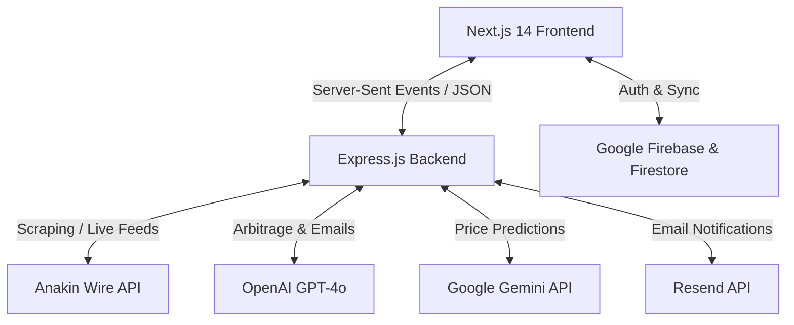

# 🎯 DealRadar — Smart Arbitrage & Deal Intelligence Platform

DealRadar is a premium, state-of-the-art product search, price tracking, and AI-powered arbitrage analysis platform. It enables users to scan products across **7 major global suppliers**, predict price movements using AI, and automatically draft vendor outreach emails to maximize profit margins.

---

## ✨ Features

### 🎬 Cinematic Landing Page
- **Visual Excellence**: A high-end dark mode landing page featuring custom HSL gradients and micro-animations.
- **Rich Motion Effects**: Features a split-text headline scroll animation and interactive elements built with Framer Motion.

### 🔍 7-Source Real-Time Search
- **Comprehensive Coverage**: Stream results live via Server-Sent Events (SSE) from **Amazon, Alibaba, AliExpress, Walmart, eBay, Etsy, and Wayfair**.
- **Interactive Ripple Loading**: Smooth staggering loading effects showing live status from all 7 APIs.
- **Smart AI Scoring**: Algorithms compute a custom deal attractiveness score for every product.

### 🧠 Triple-Agent AI Engine
- **Arbitrage Analysis**: Powered by GPT-4o, instantly scanning pricing differences and fee overheads to highlight arbitrage opportunities.
- **Vendor Email Generator**: Instant context-aware drafts optimized for supplier negotiation.
- **Gemini Price Prediction**: Powered by Google Gemini to analyze market trends and predict price movement directions.

### 📊 Advanced Dashboards
- **Watchlist & Sparklines**: Save key deals with real-time Firestore synchronization and lightweight sparkline trends.
- **Multi-Source Price History**: Visual historic price changes across suppliers using interactive Recharts line charts.
- **Unit Economics Calculator**: Calculate net margins, shipping overheads, and export records directly to CSV.
- **AI Insights Visualizer**: Beautiful charting of categorical trends, quality metrics, and performance analytics.

---

## 🏗️ Architecture



---

## 🛠️ Local Development

### Prerequisites
- Node.js (v18+)
- Firebase account & Google Cloud Platform account

### 1. Clone & Setup Configuration
Make sure to create `.env.local` inside the `frontend/` directory and `.env` inside the `backend/` directory.

#### Frontend `.env.local`
```env
NEXT_PUBLIC_FIREBASE_API_KEY=your_api_key
NEXT_PUBLIC_FIREBASE_AUTH_DOMAIN=mediflow-nexus-2026.firebaseapp.com
NEXT_PUBLIC_FIREBASE_PROJECT_ID=mediflow-nexus-2026
NEXT_PUBLIC_FIREBASE_STORAGE_BUCKET=mediflow-nexus-2026.firebasestorage.app
NEXT_PUBLIC_FIREBASE_MESSAGING_SENDER_ID=your_messaging_sender_id
NEXT_PUBLIC_FIREBASE_APP_ID=your_app_id
NEXT_PUBLIC_API_URL=http://localhost:8000
```

#### Backend `.env`
```env
PORT=8000
ANAKIN_WIRE_API_KEY=your_wire_key
GROQ_API_KEY=your_groq_key
OPENAI_API_KEY=your_openai_key
GEMINI_API_KEY=your_gemini_key
GOOGLE_CLOUD_PROJECT=mediflow-nexus-2026
FIRESTORE_DATABASE_ID=dealradar
RESEND_API_KEY=your_resend_key
CRON_SECRET=your_cron_secret
```

### 2. Start Backend Server
```bash
cd backend
npm install
node server.js
```

### 3. Start Frontend Dev Server
```bash
cd frontend
npm install
npm run dev
```
Open **[http://localhost:3000](http://localhost:3000)** in your browser to view the application.

---

## 🚀 Serverless Container Deployment (GCP Cloud Run)

DealRadar is fully containerized and deployable to Google Cloud Run:
```bash
./deploy.sh
```
This builds and pushes the backend and frontend Docker containers to **Google Container Registry (GCR)**, provisions a Firestore database, and schedules daily cron notifications for price drop alerts via **Cloud Scheduler**.
